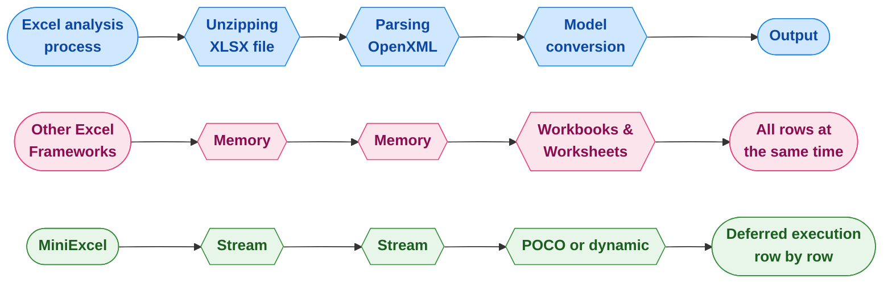

## Hi there 👋

```mermaid
flowchart LR
    A1(["Excel analysis<br>process"]) --> A2{{"Unzipping<br>XLSX file"}} --> A3{{"Parsing<br>OpenXML"}} --> A4{{"Model<br>conversion"}} --> A5(["Output"])

    B1(["Other Excel<br>Frameworks"]) --> B2{{"Memory"}} --> B3{{"Memory"}} --> B4{{"Workbooks &<br>Worksheets"}} --> B5(["All rows at<br>the same time"])

    C1(["MiniExcel"]) --> C2{{"Stream"}} --> C3{{"Stream"}} --> C4{{"POCO or dynamic"}} --> C5(["Deferred execution<br>row by row"])

    classDef analysis fill:#D0E8FF,stroke:#1E88E5,color:#0D47A1,font-weight:bold;
    classDef others fill:#FCE4EC,stroke:#EC407A,color:#880E4F,font-weight:bold;
    classDef miniexcel fill:#E8F5E9,stroke:#388E3C,color:#1B5E20,font-weight:bold;

    class A1,A2,A3,A4,A5 analysis;
    class B1,B2,B3,B4,B5 others;
    class C1,C2,C3,C4,C5 miniexcel;
```
